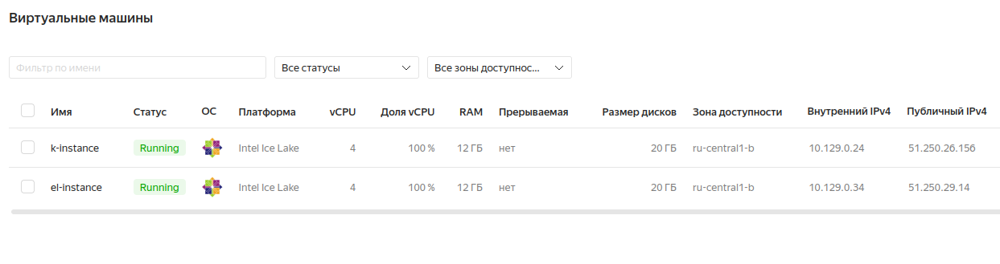
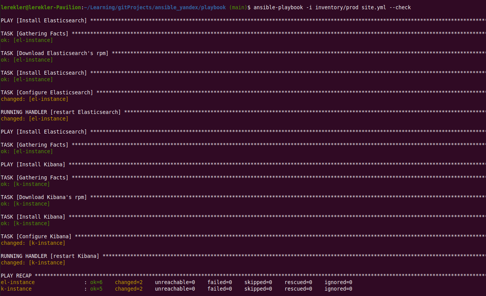
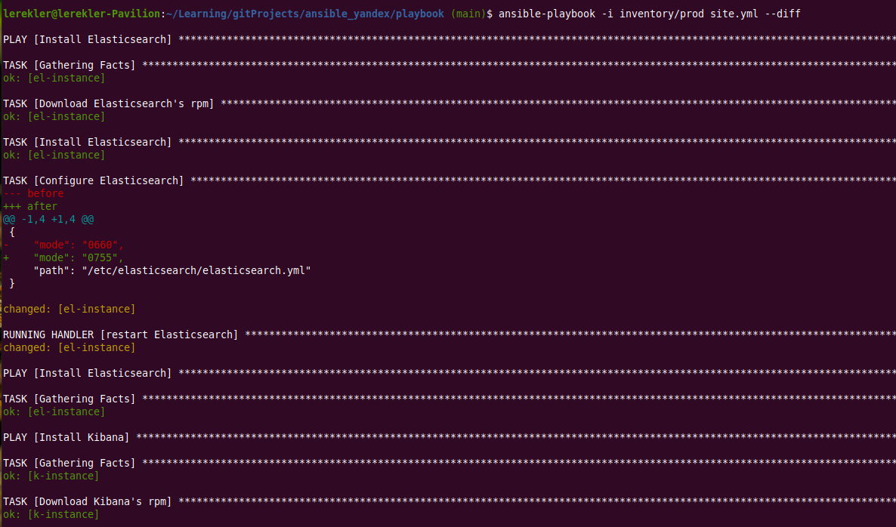
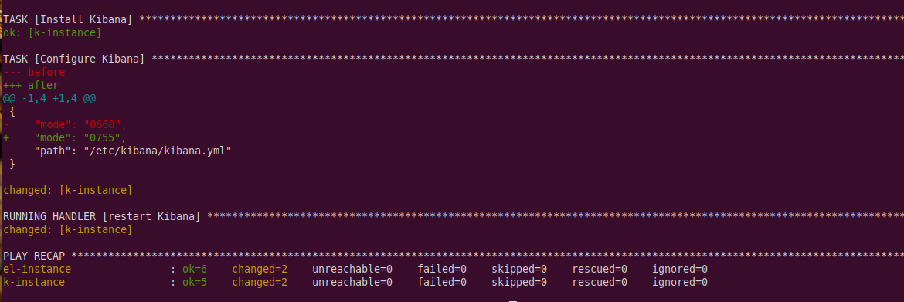
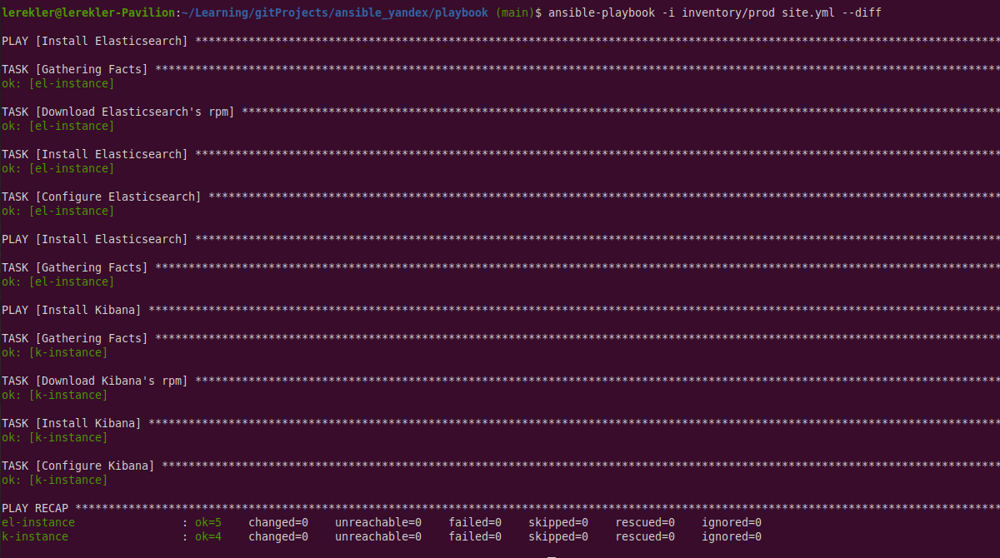
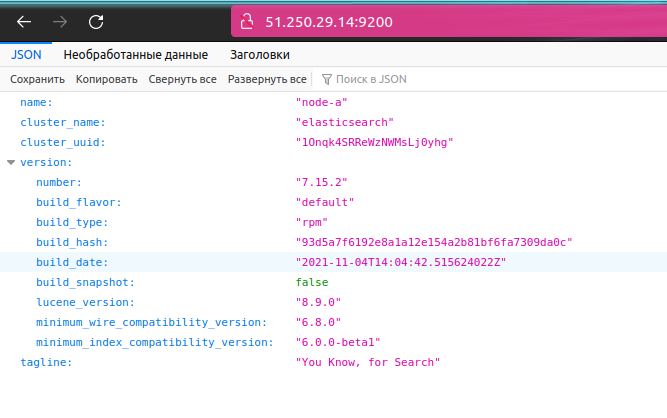
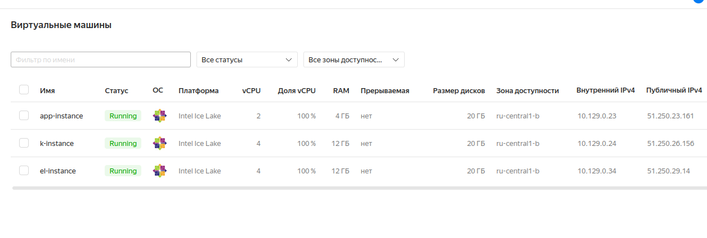
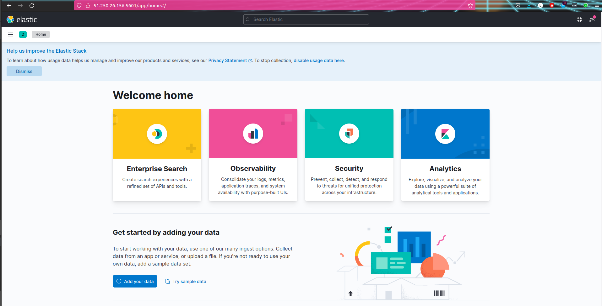

# Домашнее задание к занятию "08.03 Использование Yandex Cloud"

#### Подготовка:

* Развернула две ВМ для `kibana` и `elasticsearch` на centos 7. 
* Очень хотела сделать с `ubuntu`, но там никак не хотела работать JVM. 



#### 1. Допишите playbook: нужно сделать ещё один play, который устанавливает и настраивает kibana.
#### 2. При создании tasks рекомендую использовать модули: get_url, template, yum, apt.
#### 3. Tasks должны: скачать нужной версии дистрибутив, выполнить распаковку в выбранную директорию, сгенерировать конфигурацию с параметрами.
#### 4. Приготовьте свой собственный inventory файл prod.yml.

* `inventory/prod/group_vars/kibana.yml`:
```yaml
---
kibana_version: "7.15.2"
```
* `inventory/prod/hosts.yml`
```yaml
---
elasticsearch:
  hosts:
    el-instance:
      ansible_host: 51.250.29.14
      ansible_connection: ssh
kibana:
  hosts:
    k-instance:
      ansible_host: 51.250.26.156
      ansible_connection: ssh
```
* `site.yml Kibana`
```yaml
  tasks:
    - name: "Download Kibana's rpm"
      get_url:
        url: "https://artifacts.elastic.co/downloads/kibana/kibana-{{ kibana_version }}-x86_64.rpm"
        dest: "/tmp/kibana-{{ kibana_version }}-x86_64.rpm"
      register: download_kibana
      until: download_kibana is succeeded
    - name: Install Kibana
      become: true
      yum:
        name: "/tmp/kibana-{{ kibana_version }}-x86_64.rpm"
        state: present
    - name: Configure Kibana
      become: true
      template:
        src: kibana.yml.j2
        dest: /etc/kibana/kibana.yml
      notify: restart Kibana
```
* `kibana.yml.j2`:
```properties
server.host: "0.0.0.0"
elasticsearch.hosts: ["http://{{ hostvars['el-instance']['ansible_facts']['default_ipv4']['address'] }}:9200"]
kibana.index: ".kibana"
```

#### 5. Запустите `ansible-lint site.yml` и исправьте ошибки, если они есть.

* Есть предупреждения по доступу:
```shell
$ ansible-lint site.yml
WARNING  Overriding detected file kind 'yaml' with 'playbook' for given positional argument: site.yml
WARNING  Listing 2 violation(s) that are fatal
risky-file-permissions: File permissions unset or incorrect
site.yml:22 Task/Handler: Configure Elasticsearch

risky-file-permissions: File permissions unset or incorrect
site.yml:56 Task/Handler: Configure Kibana

You can skip specific rules or tags by adding them to your configuration file:
# .ansible-lint
warn_list:  # or 'skip_list' to silence them completely
  - experimental  # all rules tagged as experimental

Finished with 0 failure(s), 2 warning(s) on 1 files.
```

* Добавила `mode: 0755` и ошибки ушли:
```yaml
    - name: Configure Elasticsearch
      become: true
      template:
        src: elasticsearch.yml.j2
        dest: /etc/elasticsearch/elasticsearch.yml
        mode: 0755
      notify: restart Elasticsearch

- name: Configure Kibana
      become: true
      template:
        src: kibana.yml.j2
        dest: /etc/kibana/kibana.yml
        mode: 0755
      notify: restart Kibana
```

#### 6. Попробуйте запустить playbook на этом окружении с флагом `--check`.


#### 7. Запустите playbook на prod.yml окружении с флагом `--diff`. Убедитесь, что изменения на системе произведены.




#### 8. Повторно запустите playbook с флагом `--diff` и убедитесь, что playbook идемпотентен.



###### Статусы сервисов:

* `kibana`:
```shell
$ ssh 51.250.26.156
The authenticity of host '51.250.26.156 (51.250.26.156)' can't be established.
ECDSA key fingerprint is SHA256:UL+v1nPbhu+N8uGQ2Ej5j0GYM7FG7BIozAZRIxnoZko.
Are you sure you want to continue connecting (yes/no/[fingerprint])? yes
Warning: Permanently added '51.250.26.156' (ECDSA) to the list of known hosts.
[lerekler@k-instance ~]$ systemctl status kibana
● kibana.service - Kibana
   Loaded: loaded (/etc/systemd/system/kibana.service; disabled; vendor preset: disabled)
   Active: active (running) since Вс 2021-11-28 14:02:57 UTC; 1min 32s ago
     Docs: https://www.elastic.co
 Main PID: 8253 (node)
   CGroup: /system.slice/kibana.service
           └─8253 /usr/share/kibana/bin/../node/bin/node /usr/share/kibana/bin/../src/cli/dist --logging.dest="/var/log/kibana/kibana.log" --pid.file="/run/kibana/kibana.pid"
```
* `elasticsearch`:
```shell
$ ssh 51.250.29.14
The authenticity of host '51.250.29.14 (51.250.29.14)' can't be established.
ECDSA key fingerprint is SHA256:0ZSuPApIlBzzhlzpGbvCSQUAlHxeXkV6i9xjd9GrizI.
Are you sure you want to continue connecting (yes/no/[fingerprint])? yes
Warning: Permanently added '51.250.29.14' (ECDSA) to the list of known hosts.
[lerekler@el-instance ~]$ systemctl status elasticsearch
● elasticsearch.service - Elasticsearch
   Loaded: loaded (/usr/lib/systemd/system/elasticsearch.service; disabled; vendor preset: disabled)
   Active: active (running) since Вс 2021-11-28 13:58:33 UTC; 5min ago
     Docs: https://www.elastic.co
 Main PID: 8174 (java)
   CGroup: /system.slice/elasticsearch.service
           ├─8174 /usr/share/elasticsearch/jdk/bin/java -Xshare:auto -Des.networkaddress.cache.ttl=60 -Des.networkaddress.cache.negative.ttl=10 -XX:+AlwaysPreTouch -Xss1m -Djava.awt.headless=true -Dfile....
           └─8374 /usr/share/elasticsearch/modules/x-pack-ml/platform/linux-x86_64/bin/controller

```

  * Стучимся к `elasticsearch` по адресу `51.250.29.14:9200`:


#### 9. Проделайте шаги с 1 до 8 для создания ещё одного play, который устанавливает и настраивает filebeat.

* Хосты:


* Добавлено в `prod.yml`
```yaml
filebeat :
  hosts:
    app-instance:
      ansible_host: 51.250.23.161
      ansible_connection: ssh
```

* Добавлено в `site.yml`:
```yaml
- name: Install Filebeat
  hosts: filebeat
  tasks:
    - name: "Download Filebeat's rpm"
      get_url:
        url: "https://artifacts.elastic.co/downloads/beats/filebeat/filebeat-{{ filebeat_version }}-x86_64.rpm"
        dest: "/tmp/filebeat-{{ filebeat_version }}-x86_64.rpm"
      register: download_filebeat
      until: download_filebeat is succeeded
    - name: Install Filebeat
      become: true
      yum:
        name: "/tmp/filebeat-{{ filebeat_version }}-x86_64.rpm"
        state: present
    - name: Configure Filebeat
      become: true
      template:
        src: filebeat.yml.j2
        dest: /etc/filebeat/filebeat.yml
        mode: 0755
    - name: Set filebeat systemwork
      become: true
      command:
        cmd: filebeat modules enable system
        chdir: /usr/share/filebeat/bin
      register: filebeat_modules
      changed_when: filebeat_modules.stdout != 'Module system is already enabled'
    - name: Load Kibana dashboard
      become: true
      command:
        cmd: filebeat setup
        chdir: /usr/share/filebeat/bin
      register: filebeat_setup
      changed_when: false
      until: filebeat_setup is succeeded
```

* `filebeat.yml.j2`:
```properties
output.elasticsearch:
  hosts: ["http://{{ hostvars['el-instance']['ansible_facts']['default_ipv4']['address'] }}:9200"]
setup.kibana:
  host: "http://{{ hostvars['k-instance']['ansible_facts']['default_ipv4']['address'] }}:5601"
filebeat.config.modules.path: ${path.config}/modules.d/*.yml
```

* `filebeat.yml`:
```yaml
---
filebeat_version: "7.15.2"
```

* Проверка с `ansible-lint`:
```shell
$ ansible-lint site.yml
WARNING  Overriding detected file kind 'yaml' with 'playbook' for given positional argument: site.yml
```

* Запуск с `--check`:
```shell
$ ansible-playbook -i inventory/prod site.yml --check

PLAY [Install Elasticsearch] *************************************************************

TASK [Gathering Facts] *******************************************************************
ok: [el-instance]

TASK [Download Elasticsearch's rpm] ******************************************************
ok: [el-instance]

TASK [Install Elasticsearch] *************************************************************
ok: [el-instance]

TASK [Configure Elasticsearch] ***********************************************************
ok: [el-instance]

PLAY [Install Elasticsearch] *************************************************************

TASK [Gathering Facts] *******************************************************************
ok: [el-instance]

PLAY [Install Kibana] ********************************************************************

TASK [Gathering Facts] *******************************************************************
ok: [k-instance]

TASK [Download Kibana's rpm] *************************************************************
ok: [k-instance]

TASK [Install Kibana] ********************************************************************
ok: [k-instance]

TASK [Configure Kibana] ******************************************************************
ok: [k-instance]

PLAY [Install Filebeat] ******************************************************************

TASK [Gathering Facts] *******************************************************************
ok: [app-instance]

TASK [Download Filebeat's rpm] ***********************************************************
ok: [app-instance]

TASK [Install Filebeat] ******************************************************************
ok: [app-instance]

TASK [Configure Filebeat] ****************************************************************
ok: [app-instance]

TASK [Set filebeat systemwork] ***********************************************************
skipping: [app-instance]

TASK [Load Kibana dashboard] *************************************************************
skipping: [app-instance]

PLAY RECAP *******************************************************************************
app-instance               : ok=4    changed=0    unreachable=0    failed=0    skipped=2    rescued=0    ignored=0   
el-instance                : ok=5    changed=0    unreachable=0    failed=0    skipped=0    rescued=0    ignored=0   
k-instance                 : ok=4    changed=0    unreachable=0    failed=0    skipped=0    rescued=0    ignored=0   

```

* Запуск с `--diff`:
```shell
$ ansible-playbook -i inventory/prod site.yml --diff

PLAY [Install Elasticsearch] *************************************************************

TASK [Gathering Facts] *******************************************************************
ok: [el-instance]

TASK [Download Elasticsearch's rpm] ******************************************************
ok: [el-instance]

TASK [Install Elasticsearch] *************************************************************
ok: [el-instance]

TASK [Configure Elasticsearch] ***********************************************************
ok: [el-instance]

PLAY [Install Elasticsearch] *************************************************************

TASK [Gathering Facts] *******************************************************************
ok: [el-instance]

PLAY [Install Kibana] ********************************************************************

TASK [Gathering Facts] *******************************************************************
ok: [k-instance]

TASK [Download Kibana's rpm] *************************************************************
ok: [k-instance]

TASK [Install Kibana] ********************************************************************
ok: [k-instance]

TASK [Configure Kibana] ******************************************************************
ok: [k-instance]

PLAY [Install Filebeat] ******************************************************************

TASK [Gathering Facts] *******************************************************************
ok: [app-instance]

TASK [Download Filebeat's rpm] ***********************************************************
ok: [app-instance]

TASK [Install Filebeat] ******************************************************************
ok: [app-instance]

TASK [Configure Filebeat] ****************************************************************
ok: [app-instance]

TASK [Set filebeat systemwork] ***********************************************************
ok: [app-instance]

TASK [Load Kibana dashboard] *************************************************************
ok: [app-instance]

PLAY RECAP *******************************************************************************
app-instance               : ok=6    changed=0    unreachable=0    failed=0    skipped=0    rescued=0    ignored=0   
el-instance                : ok=5    changed=0    unreachable=0    failed=0    skipped=0    rescued=0    ignored=0   
k-instance                 : ok=4    changed=0    unreachable=0    failed=0    skipped=0    rescued=0    ignored=0 
```

* Заходим на хост по адресу `http://51.250.26.156:5601/app/home#/`


#### 10. Подготовьте README.md файл по своему playbook. В нём должно быть описано: что делает playbook, какие у него есть параметры и теги.

* Ссылка на [README.md](playbook/README.md)